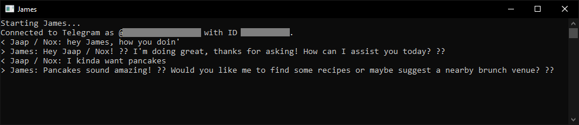

# OpenAITelegramBot
This is a simple and easy to configure 'ChatGPT' Telegram bot for anyone who wants to use or experiment with OpenAI functionality.

This bot uses the OpenAI API and a GPT model of your choice from [https://platform.openai.com/docs/models](https://platform.openai.com/docs/models).

Once the bot is running you can use the `/status`-command to get some configuration and memory information.

## Requirements
### OpenAI API Token
You need to request an OpenAI API Token here: [https://platform.openai.com/account/api-keys](https://platform.openai.com/account/api-keys).

### Telegram bot and API Token
You need to create a new 'Telegram bot' with [@botfather](https://t.me/Botfather).

### Installation
For Windows users, simply download the latest release-executable and create an `appsettings.json`-file to configure the application. Then run `OpenAITelegramBot.exe` to start it. If the application immediately closes, run from a command prompt window to see potential error output. If you prefer to build from source or use another operating system, you will need the .NET 8 SDK. Download or clone the repository into a folder, create your `appsettings.json` and simply type `dotnet run`.

## Configuration
All configuration is done in the `appsettings.json`-file. An example is included in [appsettings.template.json](appsettings.template.json) (copy or rename to `appsettings.json`). This is a simple textfile that you can open and edit with many text editors, like Microsoft Notepad.

This section describes the configuration options.

### Personality
This section contain settings that affect how the bot behaves.

* Name: The bot's display name.
* Prompt: The so-called 'system prompt', this is what defines the personality of your bot.
* RespondToName: This defines if the bot responds to its display name. Possible values are '`true`' and '`false`'. If set to '`true`', make sure to disable privacy mode in [@botfather](https://t.me/Botfather). You can do so with the command `/setprivacy`. When set to '`false`', the bot will only reply to direct @-callouts on the Telegram username, or to replies on its own messages.

### Connections
This section contains all configuration parameters to connect to both OpenAI and Telegram.

#### OpenAIAPI
* Token: The API token from [https://platform.openai.com/account/api-keys](https://platform.openai.com/account/api-keys).
* MinutesToKeep: The amount of time previous messages stay in the bots 'memory'. Recommended `10`-`60`.
* TokensToKeep: The amount of estimated tokens to keep in the bots 'memory'. 3 characters roughly equal 1 token. The amount of tokens used per request defines the processing time and cost. Recommended `2048`.
* Model: The model to use. This should be the model name as it appears in the [OpenAI API documentation](https://platform.openai.com/docs/models). Current recommended is `gpt-4` (more capable) or `gpt-3.5-turbo` (faster and cheaper).

#### TelegramAPI
* Token: The API token from [@botfather](https://t.me/Botfather).
* Username: The `@username` of your bot.
* AllowedChats: An array of Chat ID's to allow. It is **strongly** recommended to restrict the bot to a single private or group chat for both privacy- and consistency-reasons, because all messages are combined in a single conversation. This value type is a so-called 'long array' and entries can be comma-separated. Valid examples are: `[-1001233544581, 434502930]` or `[-1001233544581]` or `[null]` when not configured (every chat is allowed). To get the ID of a user group chat, you can use various options, for example [@RawDataBot](https://t.me/RawDataBot) (no affiliation, don't forget to remove this from your group after getting the ID).
* MessageLengthLimit: The maximum length of a message to accept from a user. Keep in mind that long messages have an effect on the amount of used tokens, and thus the cost and length of bot 'memory'. Recommended `1024` or lower.
* AllowPrivateMessages: This defines if the bot will accept private messages. Possible values are '`true`' and '`false`'. It is **strongly** recommended to only use this for private bots, and have your User ID in the AllowedChats list.